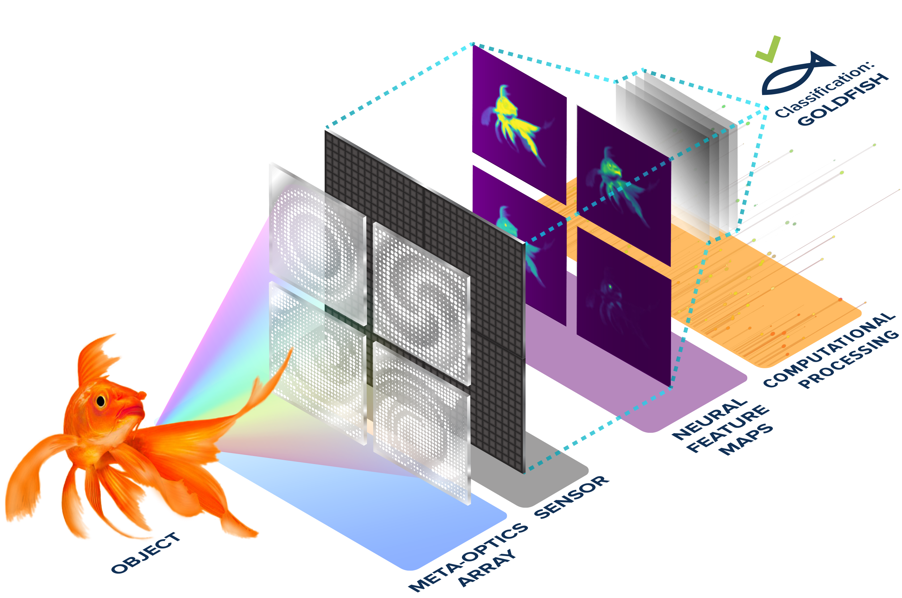
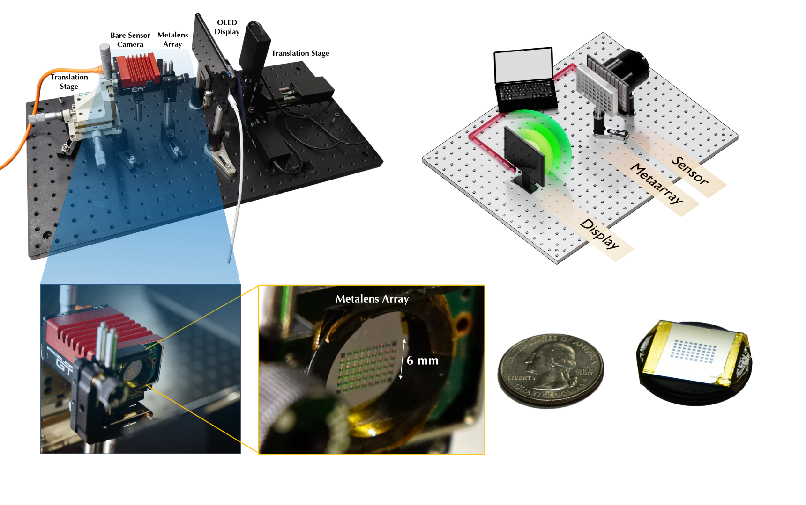

# Spatially Varying Nanophotonic Neural Networks
[**Paper**](https://light.princeton.edu/wp-content/uploads/2024/11/spatially-varying-onn.pdf) | [**Supplement**](https://www.science.org/doi/suppl/10.1126/sciadv.adp0391/suppl_file/sciadv.adp0391_sm.pdf) | [**Project Page**](https://light.princeton.edu/publication/svn3/) | [**Video**](https://www.youtube.com/watch?v=HvZFDPz5ljQ)

Official implementation of Spatially Varying Nanophotonic Neural Networks ([Science Advances 2024](https://www.science.org/doi/10.1126/sciadv.adp0391))

[Kaixuan Wei](https://kxwei.net/), [Xiao Li](https://xiao-li.net/), [Johannes Froech](https://scholar.google.com/citations?user=YDH012kAAAAJ&hl=en), [Praneeth Chakravarthula](https://www.cs.unc.edu/~cpk/), [James Whitehead](https://scholar.google.com/citations?user=Hpcg0h4AAAAJ&hl=en), [Ethan Tseng](https://ethan-tseng.github.io/), [Arka Majumdar](https://scholar.google.com/citations?user=DpIGlW4AAAAJ&hl=en), [Felix Heide](https://www.cs.princeton.edu/~fheide/)


## :sparkles: News
* 2024/11/11: **First Release**: demo/testing code.


## Highlights


<p align="center">
    
    
</p>

* What is the spatially varying nanophotonic neural network (SVN$^3$)?

 The SVN$^3$ is an optoelectronic neuromorphic computer that comprises a metalens array nanophotonic front-end and a lightweight electronic back-end for high-level vision tasks (e.g., image classification or semantic segmentation). The metalens array front-end consists of 50 metalens elements that are inversely designed and optimized by AI techniques. 
 
* What are the advantages of SVN$^3$?

 This nanophotonic front-end has an ultra-small form factor comparable to a pencil eraser while performing parallel multichannel convolutions utilizing the nature of light. Since almost all computes (99.4%) are realized passively at the speed of light with near-zero energy consumption, we achieve more than 200-fold faster computation compared to existing GPU-based inference.


## Quick Start

We provide a commented jupyter notebook `demo_SVN3.ipynb` along all necessary utilities for quick start. 
Specifically, the code implements the spatially-varying nanophotonic neural networks (and its siblings for ablation study), provides seven pretrained model weights (6 for simulation, 1 for experimental data). Please refer to the notebook for details.

## Requirements 

Our code build upon modern deep learning framework [Pytorch](https://pytorch.org/). To run the demo, please first install it by following instructions in  Pytorch's website. Then install [flops-profiler](https://github.com/cli99/flops-profiler) which is required to profile models.

This code has been tested with Python 3.9.15 using Pytorch 1.13.1 running on Linux with an Nvidia A100 GPU. Lower or higher version might also work but may require some minor modifications.


## Citation

If you find our code helpful in your research or work please cite our paper.

```bibtex
@article{wei2024svn3,
    author = {Kaixuan Wei  and Xiao Li  and Johannes Froech  and Praneeth Chakravarthula  and James Whitehead  and Ethan Tseng  and Arka Majumdar  and Felix Heide },
    title = {Spatially varying nanophotonic neural networks},
    journal = {Science Advances},
    volume = {10},
    number = {45},
    pages = {eadp0391},
    year = {2024},
    doi = {10.1126/sciadv.adp0391},
}
```

## Contact
If you find any problem, please feel free to contact me (kaixuan.wei at kaust.edu.sa).
A brief self-introduction (including your name, affiliation and position) is required, if you would like to get an in-depth help from me. 
I'd be glad to talk with you if more information (e.g. your personal website link) is attached. 
